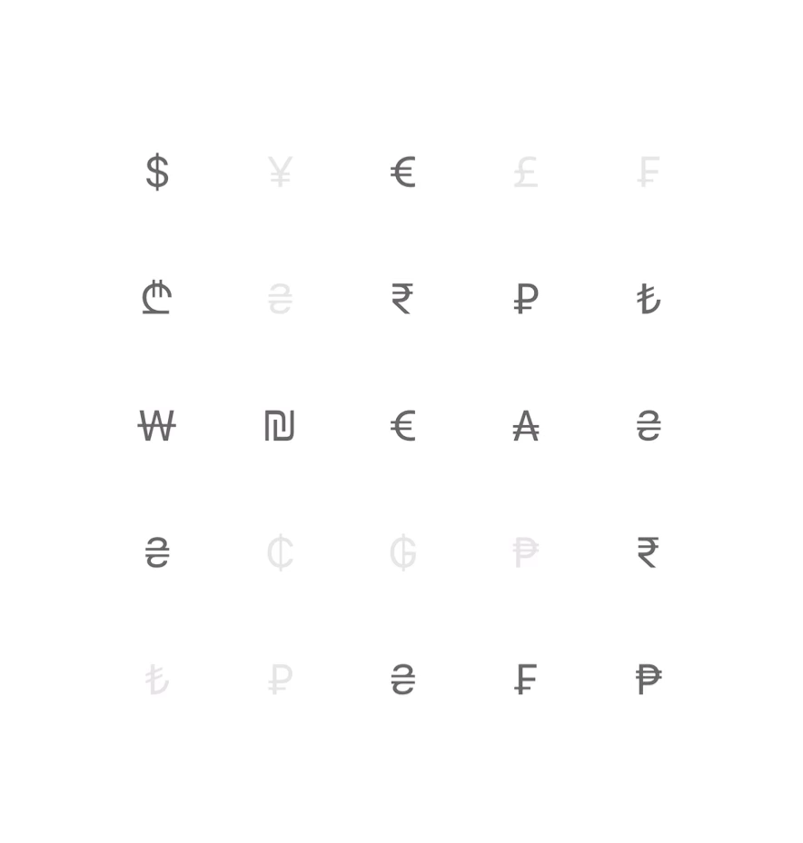

# 📦 OpacityMotion

`OpacityMotion` is an iOS library that animates the **opacity** of UI elements based on the device's tilt. It works with **arrays of elements** (texts, images, or custom structures) and provides customizable **minimum/maximum opacity**, **sensitivity to motion**, and the ability to adjust **the number of columns** and **spacing** between the elements, allowing for smooth and dynamic visual effects.

> **Note**: **Test on a real device** is required, as motion data is unavailable on the simulator.

---

## 🛠 Installation

### Using Swift Package Manager

1. Open your project in Xcode.
2. Go to **File > Swift Packages > Add Package Dependency**.
3. Enter the repository URL:

   ```
   https://github.com/aemllif/OpacityMotion.git
   ```

4. Choose the version or branch to connect.

---

## ⚙️ How to Use

### Example 1: With an Array of Symbols



```swift
import SwiftUI
import OpacityMotion

struct ContentView: View {
    let symbols = [
        "$", "¥", "€", "£", "₣",
        "₾", "₴", "₹", "₽", "₺",
        "₩", "₪", "€", "₳", "₴",
        "₴", "₵", "₲", "₱", "₹",
        "₺", "₽", "₴", "₣", "₱"
    ]

    var body: some View {
        OpacityMotionView(
            items: symbols,  // Array of symbols
            columns: Array(repeating: GridItem(.fixed(50), spacing: 10), count: 5),  // 5 columns
            rowSpacing: 12,  // Space between rows
            minOpacity: 0.1,  // Minimum opacity
            maxOpacity: 0.6,  // Maximum opacity
            intensity: 1.0    // Sensitivity to tilt
        ) { symbol in
            Text(symbol)
                .font(.title2)
                .frame(width: 50, height: 50)
        }
        .padding()
    }
}
```

### Example 2: With an Array of Images


```swift
import SwiftUI
import OpacityMotion

struct ContentView: View {
    let images = ["1", "2", "3", "4"]
        .compactMap { UIImage(named: $0) }

    var body: some View {
        OpacityMotionView(
            items: images,
            columns: Array(repeating: GridItem(.fixed(60), spacing: 50), count: 2),
            rowSpacing: 20,
            minOpacity: 0.1,
            maxOpacity: 1.0,
            intensity: 1.0
        ) { image in
            Image(uiImage: image)
                .resizable()
                .scaledToFit()
                .frame(width: 100, height: 100)
        }
        .padding()
    }
}
```

### Parameters:

- **items**: An array of elements (can be strings, images, or any other structure).
- **columns**: An array of `GridItem` elements, used to define the number and width of columns.
- **rowSpacing**: The vertical spacing between rows (default `12`).
- **minOpacity**: The minimum opacity of the element (default `0.0`).
- **maxOpacity**: The maximum opacity of the element (default `0.5`).
- **intensity**: The sensitivity of the opacity change based on the device's tilt (default `0.7`).

---

## 📜 Description

`OpacityMotion` uses **CoreMotion** to access the device’s attitude — a combination of data from the **gyroscope**, **accelerometer**, and **magnetometer**, processed through an internal **Kalman filter** for improved accuracy and stability. Based on this fused motion data, the library dynamically adjusts the opacity of each element depending on the device's tilt along the **X** and **Y** axes. 

### Features:
- Supports any data types (texts, images, and other structures).
- Smooth opacity animation.
- Configurable minimum and maximum opacity values.
- Adjustable number of columns and row spacing.
- High sensitivity to the device's tilt.
- Uses motion fusion via Kalman filtering for smooth tilt detection.

---

## 🔧 Settings and Parameters

- **`columns`**: Defines the number of columns and their width (default `5` columns with 50pt width and 10pt spacing).
- **`rowSpacing`**: Vertical space between rows (default `12`).
- **`minOpacity`**: Minimum opacity (default `0.0`).
- **`maxOpacity`**: Maximum opacity (default `0.5`).
- **`intensity`**: Sensitivity of opacity change (default `0.7`).

---

## 📝 License

`OpacityMotion` is licensed under the MIT License. See the [LICENSE](./LICENSE) file for more details.

---

## 📄 Changelog

### 🚀 Version 1.0.0
- Initial release of the library.
- Implemented opacity animation based on the device's tilt.
- Supports any type of elements for animation (texts, images, and other structures).
- Added customizable columns and row spacing.

---

## 🛠 Feedback and Issues

For suggestions or bug reports, please create issues or pull requests in the repository on GitHub.
